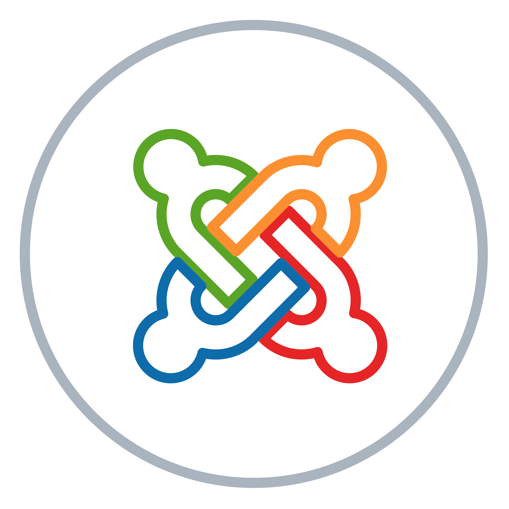

# Dev Connect

A MERN Stack (impaired with redux) social media application for developers to connect.

<p align="center">

</p>

## Development

To run the application locally

-   Clone the repository locally

```sh
https://github.com/akshatmittal61/dev-connect.git
```

-   Enter into the repo

```sh
cd dev-connect
```

-   Install the dependencies

```sh
npm i
```

-   Start the frontend server

```sh
npm run react
```

-   Start the backend server

```sh
npm start
```

**Note:** To continue to run backend server after changes too, install nodemon on your system

```sh
npm i nodemon -g
```

-   The, run the backend server by:

```sh
npm run server
```

Visit [http://localhost:3000](http://localhost:3000) in your browser.

The backend server runs on port 5000 i.e.) [http://localhost:5000](http://localhost:5000).
